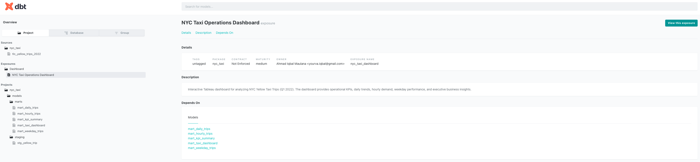

# NYC Taxi Analytics Pipeline with BigQuery, dbt & Tableau

## Project Overview

This project documents my hands-on learning journey in building an end-to-end analytics pipeline using Google BigQuery, dbt Core, and Tableau.

Using the NYC Yellow Taxi Trip Records (Q1 2022), I built an end-to-end analytics pipeline that transforms raw trip data into analytics-ready data marts for interactive Tableau reporting.

Throughout this project, I implemented a modern analytics workflow, including data warehousing in BigQuery, SQL-based transformations with dbt, data validation, and dashboard development in Tableau.

Due to the limitations of a personal Google Cloud account and resource quotas, the complete NYC Yellow Taxi dataset was not practical to process within this project. Therefore, the analysis focuses on Q1 2022, while the end-to-end ELT workflow, data modeling, and dashboard development reflect the same practices used in real-world analytics projects.

## Project Highlights

- End-to-end ELT workflow using Google BigQuery and dbt
- Modular dbt data models (Source → Staging → Mart)
- SQL-based transformations to build analytics-ready data marts
- Interactive Tableau dashboard with executive KPIs
- Maintainable analytics project structure with Git and GitHub

---

## Learning Objectives

The primary objective of this project is to gain practical experience in building a modern analytics engineering workflow using industry-standard tools.

Throughout this project, I practiced:

- Building a cloud-based data warehouse using Google BigQuery
- Developing modular SQL transformations with dbt
- Building staging and mart models using dbt
- Applying data quality validation with dbt tests
- Generating dbt documentation and model lineage
- Designing an interactive Tableau dashboard
- Managing project version control and documentation with Git and GitHub

---

## Dataset

**Dataset Used**

NYC TLC Yellow Taxi Trip Records (Q1 2022)

**Dataset Size**

Analysis Scope

Q1 2022 (~8.6 million trip records)

**Source**

NYC Taxi & Limousine Commission (TLC)

https://www.nyc.gov/site/tlc/about/tlc-trip-record-data.page

**Data Platform**

Google BigQuery Public Dataset

https://console.cloud.google.com/marketplace/product/city-of-new-york/nyc-tlc-trips

**Dataset Characteristics**

- Public NYC Yellow Taxi trip records
- Analysis period: January – March 2022 (Q1 2022)
- Millions of trip-level records
- Transactional transportation dataset
- Public dataset hosted on Google BigQuery

**Key Attributes**

- Pickup & Dropoff Datetime
- Passenger Count
- Trip Distance
- Fare Amount
- Total Amount
- Payment Type
- Pickup & Dropoff Location

> **Note**
>
> Due to the limitations of a personal Google Cloud account and resource quotas, the complete NYC Yellow Taxi dataset was not practical to process within this project. Therefore, the analysis focuses on Q1 2022, while the end-to-end ELT workflow, data modeling, and dashboard development reflect the same practices used in real-world analytics projects.

---

## Tech Stack

| Category | Technology |
|----------|------------|
| Code Editor | Visual Studio Code |
| Data Warehouse | Google BigQuery |
| Transformation Framework | dbt Core (SQL) |
| Data Visualization | Tableau Public |
| Version Control | Git & GitHub |

---

## Project Architecture

This project follows a modern ELT (Extract, Load, Transform) architecture. Raw NYC Yellow Taxi trip data is stored in Google BigQuery, transformed into modular staging and mart models using dbt, exported as analytics-ready datasets, and visualized through an interactive Tableau dashboard.

```text
NYC Yellow Taxi Trip Records
            │
            ▼
    Google BigQuery
            │
            ▼
   dbt Staging Models
            │
            ▼
    dbt Mart Models
            │
            ▼
Analytics-ready Data Marts
            │
            ▼
       CSV Export
            │
            ▼
   Tableau Dashboard
```

---

## Data Model

The project follows a layered dbt modeling approach to transform raw trip data into analytics-ready data marts for reporting and dashboard development.

### Source Layer

The raw NYC Yellow Taxi Trip Records are stored in Google BigQuery without business transformations. This layer serves as the single source of truth for the project.

### Staging Layer

The staging layer standardizes the raw data by:

- Renaming columns with consistent naming conventions
- Converting data types
- Creating derived date and time attributes
- Preparing clean datasets for downstream transformations

### Mart Layer

The mart layer contains analytics-ready data marts optimized for reporting and Tableau dashboards.

| Model | Description |
|--------|-------------|
| `mart_daily_trips` | Daily revenue and trip performance |
| `mart_hourly_trips` | Trip distribution by hour |
| `mart_weekday_trips` | Revenue and trips by weekday |
| `mart_kpi_summary` | Executive KPI summary |
| `mart_taxi_dashboard` | Consolidated reporting model for dashboard development |

This layered modeling approach improves maintainability, reusability, and scalability for analytics workflows.

---

## dbt Lineage

The transformation workflow was built with dbt Core using modular SQL models, dependency management, automated testing, and project documentation.

The lineage graph below illustrates how the source table is transformed into staging and mart models before being consumed by the analytics dashboard.

### Lineage Graph


The modular architecture improves the maintainability, readability, and scalability of the transformation pipeline.

---

## Dashboard Preview

The final Tableau dashboard presents an executive view of NYC Yellow Taxi operations during Q1 2022, highlighting key performance indicators and operational trends through interactive visualizations.

### Dashboard Highlights

- Executive KPI summary
- Monthly revenue analysis
- Daily revenue trend
- Hourly trip distribution
- Revenue by weekday
- Interactive month filter (January–March 2022)

### Dashboard Screenshot


### Live Dashboard

Tableau Public

https://public.tableau.com/app/profile/data.analyst.iqbal/viz/nyc_taxi_17834090367390/Dashboard1

---

## Dashboard Features

The Tableau dashboard provides an interactive overview of NYC Yellow Taxi operations during Q1 2022 through executive KPIs and operational performance visualizations.

### Executive KPIs

- Total Revenue
- Total Trips
- Average Trip Value
- Average Passengers per Trip

### Visualizations

- Monthly Revenue Trend
- Daily Revenue Trend
- Hourly Trip Distribution
- Revenue by Weekday

### Interactive Features

- Interactive month filter (January–March 2022)
- Dynamic KPI updates
- Cross-chart filtering
- Interactive tooltips

### Dashboard Design

The dashboard was built using Tableau containers to create a structured, consistent, and responsive reporting layout.

---

### Interactive dbt Docs

The project documentation was generated using dbt Docs, providing an interactive view of model metadata, dependencies, and transformation lineage.

### dbt Docs Screenshot



### Live dbt Docs

Coming soon...

---

## Business Insights

The dashboard provides interactive insights into NYC Yellow Taxi operations, helping answer key business questions through executive KPIs and visual analytics.

The dashboard helps answer questions such as:

- How does total revenue change throughout Q1 2022?
- Which month generates the highest revenue?
- What are the busiest operating hours?
- Which weekdays contribute the most trips and revenue?
- How does daily revenue fluctuate over time?
- What is the average value of each completed trip?
- What is the average number of passengers per trip?

These insights help transform raw trip records into actionable business information through an intuitive reporting interface.

---

## Repository Structure

```text
dbt-bigquery-nyc-taxi-analytics
│
├── assets
│   ├── dashboard.png
│   ├── bigquery_schema.png
│   ├── lineage_graph.png
│   └── dbt_docs.png
│
├── data
│   └── exports
│       ├── daily_trips.csv
│       ├── hourly_trips.csv
│       ├── kpi_summary.csv
│       └── weekday_trips.csv
│
├── dbt
│
├── sql
│   ├── 01_staging
│   ├── 02_marts
│   └── 03_validation
│
├── tableau
│   └── nyc_taxi.twb
│
├── README.md
├── LICENSE
└── .gitignore
```

The repository is organized to separate data transformation models, exported datasets, Tableau assets, and project documentation, making the project easier to understand, maintain, and extend.

---

## Project Status

### Completed

- ✅ Google BigQuery environment configured
- ✅ NYC Yellow Taxi dataset integrated
- ✅ dbt project configured
- ✅ Staging and mart models developed
- ✅ SQL transformations implemented with dbt
- ✅ dbt tests executed successfully
- ✅ dbt documentation generated
- ✅ dbt lineage graph generated
- ✅ Analytics-ready datasets exported
- ✅ Interactive Tableau dashboard completed
- ✅ Project documentation completed
- ✅ GitHub repository published

## Future Improvements

Future enhancements planned for this project include:

- Publish interactive dbt Docs with GitHub Pages
- Expand the analysis beyond Q1 2022
- Build additional business-focused mart models
- Connect Tableau directly to BigQuery instead of CSV exports
- Implement automated CI/CD workflows for dbt

---

## Author

**Ahmad Iqbal Maulana**

- LinkedIn: https://www.linkedin.com/in/ahmad-iqbal-maulana-9669b8228
- GitHub: https://github.com/yourvaiqbal
- Tableau Public: https://public.tableau.com/app/profile/data.analyst.iqbal
