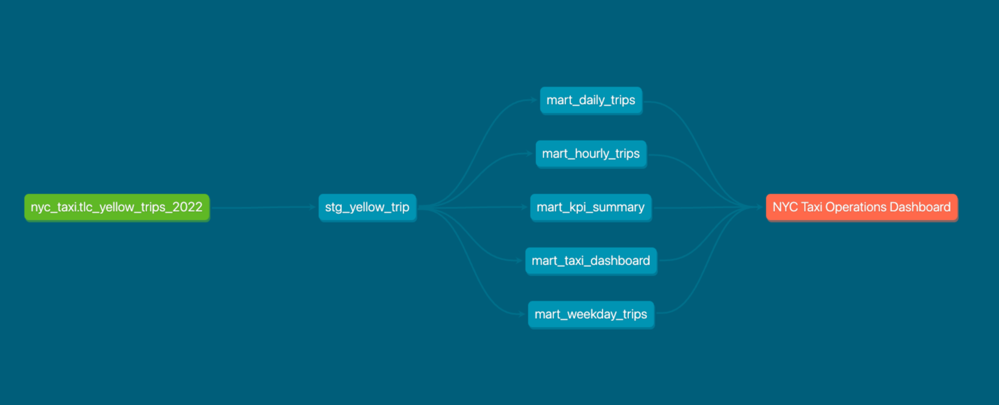

# NYC Taxi Analytics Pipeline with BigQuery, dbt & Tableau

## Project Overview

This project documents my hands-on learning journey in building an end-to-end data analytics pipeline using Google BigQuery, dbt Core, SQL, and Tableau.

Using the NYC Yellow Taxi Trip Records (Q1 2022), I practiced transforming raw transactional data into business-ready datasets before developing an interactive dashboard using Tableau for reporting and analysis.

Throughout this project, I explored a modern analytics workflow, including data warehousing in BigQuery, SQL transformation, dbt modeling, data validation, and dashboard development in Tableau.

Due to the limitations of a personal Google Cloud account, this project focuses on NYC Yellow Taxi trips during Q1 2022. Although the dataset scope is intentionally limited, the overall workflow reflects practices commonly used in real-world data analytics projects.

---

## Learning Objectives

The primary objective of this project is to gain practical experience in building a modern data analytics workflow using industry-standard tools.

Throughout this project, I practiced:

- Building a cloud-based data warehouse using Google BigQuery
- Writing SQL transformations to create business-ready datasets
- Learning and implementing dbt for modular data transformation
- Organizing data into staging and mart layers
- Applying basic data validation using dbt tests
- Exporting aggregated datasets for reporting
- Designing an interactive dashboard in Tableau
- Managing project documentation and version control with GitHub

---

## Dataset

**Dataset Used**

NYC TLC Yellow Taxi Trip Records (Q1 2022)

**Source**

NYC Taxi & Limousine Commission (TLC)

https://www.nyc.gov/site/tlc/about/tlc-trip-record-data.page

**Data Platform**

Google BigQuery Public Dataset

https://console.cloud.google.com/marketplace/product/city-of-new-york/nyc-tlc-trips

**Dataset Characteristics**

- Public NYC Yellow Taxi trip records
- Analysis period: January – March 2022 (Q1 2022)
- Millions of trip-level records
- Transactional transportation dataset
- Public dataset hosted on Google BigQuery

**Key Attributes**

- Pickup & Dropoff Datetime
- Passenger Count
- Trip Distance
- Fare Amount
- Total Amount
- Payment Type
- Pickup & Dropoff Location

> **Note**
>
> This project focuses on NYC Yellow Taxi trips during Q1 2022. The analysis period was intentionally limited to accommodate the storage and query limitations of a personal Google Cloud account while maintaining a realistic end-to-end analytics workflow.

---

## Tech Stack

| Category | Technology |
|----------|------------|
| Code Editor | Visual Studio Code |
| Data Warehouse | Google BigQuery |
| Data Transformation | dbt Core |
| Query Language | SQL |
| Version Control | Git & GitHub |
| Data Visualization | Tableau Public |

---

## Dashboard Preview

The final dashboard was developed in Tableau to provide an executive summary of NYC Yellow Taxi performance during Q1 2022.

**Dashboard Highlights**

- Executive KPI summary
- Monthly revenue analysis
- Daily revenue trend
- Hourly trip distribution
- Revenue by weekday
- Interactive month filter (January–March 2022)

### Dashboard Screenshot


### Interactive Dashboard

Tableau Public

[https://public.tableau.com/app/profile/data.analyst.iqbal](https://public.tableau.com/app/profile/data.analyst.iqbal/viz/nyc_taxi_17834090367390/Dashboard1)

---

## Project Architecture

This project follows a modern ELT (Extract, Load, Transform) workflow. Raw trip data is loaded into Google BigQuery, transformed into business-ready datasets using SQL and dbt, exported as aggregated reporting tables, and finally visualized in Tableau.

```text
NYC Yellow Taxi Trip Records
                │
                ▼
        Google BigQuery
                │
                ▼
      SQL Transformation
                │
                ▼
         dbt Data Models
                │
                ▼
      Analytics Data Mart
                │
                ▼
     Aggregated CSV Export
                │
                ▼
      Tableau Dashboard
```

---

## Data Model

The project follows a layered data modeling approach to transform raw transactional data into business-ready datasets for reporting and dashboard development.

### Source Layer

The raw NYC Yellow Taxi Trip Records are stored in Google BigQuery without business transformations. This layer serves as the single source of truth for the project.

### Staging Layer

The staging layer standardizes the raw data by:

- Renaming columns with consistent naming conventions
- Converting data types
- Removing unnecessary fields
- Creating derived date and time attributes
- Preparing clean datasets for downstream transformations

### Mart Layer

The mart layer contains aggregated datasets optimized for business reporting and Tableau dashboards.

The following reporting tables were created:

| Model | Description |
|--------|-------------|
| `mart_daily_trips` | Daily revenue and trip performance |
| `mart_hourly_trips` | Trip distribution by hour of day |
| `mart_weekday_trips` | Revenue and trips by weekday |
| `mart_kpi_summary` | Executive KPI summary for dashboard |

This layered approach improves data organization, simplifies maintenance, and supports reusable analytics workflows.

---

## dbt Lineage

The data transformation workflow was implemented using dbt Core, allowing each transformation step to be organized into reusable and modular data models.

The lineage graph illustrates the dependency between the source data, staging model, and mart models, making the transformation pipeline easier to understand, maintain, and extend.

### Lineage Graph



### Interactive dbt Documentation

Explore the generated dbt documentation, including model lineage, metadata, and dependencies.

🔗 **Live dbt Docs**

https://YOUR_DBT_DOCS_LINK

The modular design enables each transformation model to be developed, tested, and maintained independently while preserving clear dependencies across the entire analytics workflow.

---

## Dashboard Features

The Tableau dashboard provides an interactive overview of NYC Yellow Taxi performance during Q1 2022. It is designed to present key operational metrics and trends through a clean executive reporting interface.

### Executive KPIs

- Total Revenue
- Total Trips
- Average Trip Value
- Average Passengers per Trip

### Visualizations

- Monthly Revenue Comparison
- Daily Revenue Trend
- Hourly Trip Distribution
- Revenue by Weekday

### Interactive Features

- Month filter (January–March 2022)
- Dynamic KPI updates
- Interactive chart filtering
- Detailed tooltips for each visualization

### Dashboard Design

The dashboard was designed using a container-based layout in Tableau to ensure a structured, consistent, and maintainable reporting interface.

---

## Repository Structure

```text
dbt-bigquery-nyc-taxi-analytics
│
├── assets
│   ├── dashboard.png
│   ├── bigquery_schema.png
│   ├── lineage_graph.png
│   └── dbt_docs.png
│
├── data
│   └── exports
│       ├── daily_trips.csv
│       ├── hourly_trips.csv
│       ├── kpi_summary.csv
│       └── weekday_trips.csv
│
├── dbt
│
├── sql
│   ├── 01_staging
│   ├── 02_marts
│   └── 03_validation
│
├── tableau
│   └── nyc_taxi.twb
│
├── README.md
├── LICENSE
└── .gitignore
```

The repository is organized to separate SQL transformations, exported datasets, Tableau assets, project documentation, and future dbt development, making the project easier to maintain and extend.

---

## Business Insights

The dashboard enables users to explore operational performance and answer key business questions using interactive visualizations and KPI summaries.

Some examples include:

- How does total revenue change throughout Q1 2022?
- Which month generates the highest revenue?
- What are the busiest operating hours?
- Which weekdays contribute the most trips and revenue?
- How does daily revenue fluctuate over time?
- What is the average value of each completed trip?
- What is the average number of passengers per trip?

These insights help transform raw trip records into actionable business information through an intuitive reporting interface.

---

## Project Status & Future Improvements

### Completed

- ✅ Google BigQuery environment configured
- ✅ NYC Yellow Taxi dataset imported
- ✅ SQL transformation pipeline developed
- ✅ Staging and mart data models created
- ✅ dbt project configured
- ✅ dbt models executed successfully
- ✅ dbt tests completed
- ✅ dbt documentation generated
- ✅ dbt lineage graph generated
- ✅ Aggregated reporting datasets exported
- ✅ Interactive Tableau dashboard completed
- ✅ Project documentation completed
- ✅ GitHub repository organized

### Next Improvements

- Publish interactive dbt Docs with GitHub Pages
- Expand the data model with additional mart tables
- Extend the analysis beyond Q1 2022
- Replace exported CSV datasets with direct BigQuery connectivity in Tableau

---

## Author

**Ahmad Iqbal Maulana**

- **LinkedIn**  
  https://www.linkedin.com/in/ahmad-iqbal-maulana-9669b8228

- **GitHub**  
  https://github.com/yourvaiqbal

- **Tableau Public**  
  https://public.tableau.com/app/profile/data.analyst.iqbal
