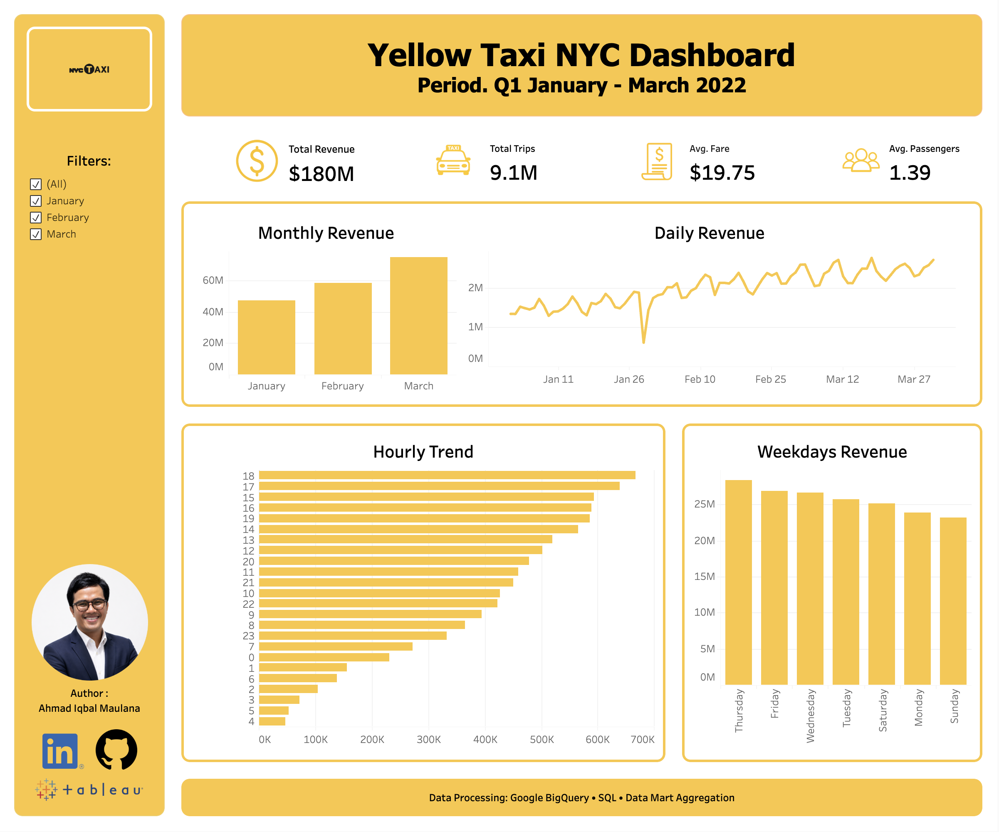

# NYC Taxi Analytics Pipeline with BigQuery, dbt & Tableau

## Project Overview

This project documents my hands-on learning journey in building an end-to-end data analytics pipeline using Google BigQuery, dbt Core, SQL, and Tableau.

Using the NYC Yellow Taxi Trip Records (Q1 2022), I practiced transforming raw transactional data into business-ready datasets before developing an interactive dashboard using Tableau for reporting and analysis.

Throughout this project, I explored a modern analytics workflow, including data warehousing in BigQuery, SQL transformation, dbt modeling, data validation, and dashboard development in Tableau.

Due to the limitations of a personal Google Cloud account, this project focuses on NYC Yellow Taxi trips during Q1 2022. Although the dataset scope is intentionally limited, the overall workflow reflects practices commonly used in real-world data analytics projects.

---

## Learning Objectives

The primary objective of this project is to gain practical experience in building a modern data analytics workflow using industry-standard tools.

Throughout this project, I practiced:

- Building a cloud-based data warehouse using Google BigQuery
- Writing SQL transformations to create business-ready datasets
- Learning and implementing dbt for modular data transformation
- Organizing data into staging and mart layers
- Applying basic data validation using dbt tests
- Exporting aggregated datasets for reporting
- Designing an interactive dashboard in Tableau
- Managing project documentation and version control with GitHub

---

## Dataset

**Dataset Used**

NYC TLC Yellow Taxi Trip Records (Q1 2022)

**Source**

NYC Taxi & Limousine Commission (TLC)

https://www.nyc.gov/site/tlc/about/tlc-trip-record-data.page

**Data Platform**

Google BigQuery Public Dataset

https://console.cloud.google.com/marketplace/product/city-of-new-york/nyc-tlc-trips

**Dataset Characteristics**

- Public NYC Yellow Taxi trip records
- Analysis period: January – March 2022 (Q1 2022)
- Millions of trip-level records
- Transactional transportation dataset
- Public dataset hosted on Google BigQuery

**Key Attributes**

- Pickup & Dropoff Datetime
- Passenger Count
- Trip Distance
- Fare Amount
- Total Amount
- Payment Type
- Pickup & Dropoff Location

> **Note**
>
> This project focuses on NYC Yellow Taxi trips during Q1 2022. The analysis period was intentionally limited to accommodate the storage and query limitations of a personal Google Cloud account while maintaining a realistic end-to-end analytics workflow.

---

## Tech Stack

| Category | Technology |
|----------|------------|
| Code Editor | Visual Studio Code |
| Data Warehouse | Google BigQuery |
| Data Transformation | dbt Core |
| Query Language | SQL |
| Version Control | Git & GitHub |
| Data Visualization | Tableau Public |

---

## Dashboard Preview

The final dashboard was developed in Tableau to provide an executive summary of NYC Yellow Taxi performance during Q1 2022.

**Dashboard Highlights**

- Executive KPI summary
- Monthly revenue analysis
- Daily revenue trend
- Hourly trip distribution
- Revenue by weekday
- Interactive month filter (January–March 2022)

### Dashboard Screenshot



### Interactive Dashboard

Tableau Public

[https://public.tableau.com/app/profile/data.analyst.iqbal](https://public.tableau.com/app/profile/data.analyst.iqbal/viz/nyc_taxi_17834090367390/Dashboard1)

---

## Project Architecture

Raw Data (BigQuery)

↓

Source Layer

↓

Staging Layer (dbt)

↓

Mart Layer (dbt)

↓

CSV Export

↓

Tableau Dashboard

---

## dbt Models

### Source

* stg_taxi_q1_2022

### Staging

* stg_taxi_trip

### Mart

* mart_daily_trips
* mart_hourly_trips
* mart_weekday_trips
* mart_kpi_summary

## dbt Lineage

[image]

---

## Data Quality Tests

Implemented dbt tests:

* not_null pickup_datetime
* not_null total_amount

---

## Key Performance Indicators (KPIs)

* Total Trips
* Total Revenue
* Total Passengers
* Average Revenue per Trip
* Peak Operating Hours
* Busiest Weekdays

---

## Business Questions

1. Which days generate the highest number of trips?
2. Which hours are the busiest?
3. How much revenue is generated daily?
4. How many passengers are transported over time?

---

## Repository Structure

```text
models/
├── staging/
│   └── stg_taxi_trip.sql

└── marts/
    ├── mart_daily_trips.sql
    ├── mart_hourly_trips.sql
    ├── mart_weekday_trips.sql
    └── mart_kpi_summary.sql
```

---

## Project Status

* Data Source Connected
* dbt Models Built
* Data Tests Passed
* Documentation Generated
* Lineage Graph Created
* GitHub Repository Published
* Tableau Dashboard (In Progress)

---

## Author

Ahmad Iqbal Maulana

LinkedIn:
https://www.linkedin.com/in/ahmad-iqbal-maulana-9669b8228

GitHub:
https://github.com/yourvaiqbal
